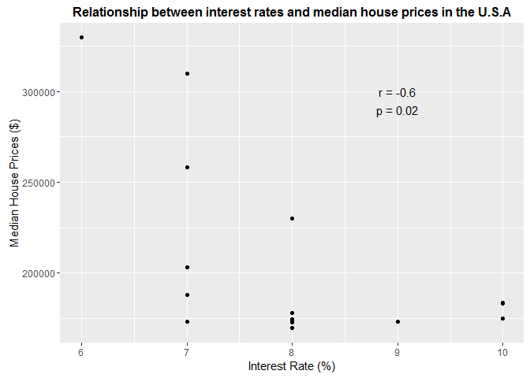
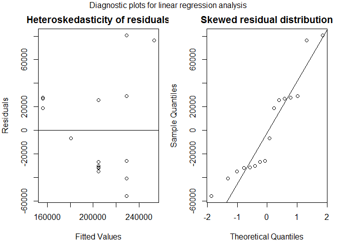

Assignment 6
================
Bongani Mveng
29 August 2016

Hello Octocat
-------------

I love Octocat. She's the coolest cat in town.


``` r
data(anscombe)
dim(anscombe)
```

    ## [1] 11  8

``` r
colnames(anscombe)
```

    ## [1] "x1" "x2" "x3" "x4" "y1" "y2" "y3" "y4"

``` r
head(anscombe)
```

    ##   x1 x2 x3 x4   y1   y2    y3   y4
    ## 1 10 10 10  8 8.04 9.14  7.46 6.58
    ## 2  8  8  8  8 6.95 8.14  6.77 5.76
    ## 3 13 13 13  8 7.58 8.74 12.74 7.71
    ## 4  9  9  9  8 8.81 8.77  7.11 8.84
    ## 5 11 11 11  8 8.33 9.26  7.81 8.47
    ## 6 14 14 14  8 9.96 8.10  8.84 7.04

``` r
tail(anscombe)
```

    ##    x1 x2 x3 x4    y1   y2   y3    y4
    ## 6  14 14 14  8  9.96 8.10 8.84  7.04
    ## 7   6  6  6  8  7.24 6.13 6.08  5.25
    ## 8   4  4  4 19  4.26 3.10 5.39 12.50
    ## 9  12 12 12  8 10.84 9.13 8.15  5.56
    ## 10  7  7  7  8  4.82 7.26 6.42  7.91
    ## 11  5  5  5  8  5.68 4.74 5.73  6.89

``` r
summary(anscombe)
```

    ##        x1             x2             x3             x4    
    ##  Min.   : 4.0   Min.   : 4.0   Min.   : 4.0   Min.   : 8  
    ##  1st Qu.: 6.5   1st Qu.: 6.5   1st Qu.: 6.5   1st Qu.: 8  
    ##  Median : 9.0   Median : 9.0   Median : 9.0   Median : 8  
    ##  Mean   : 9.0   Mean   : 9.0   Mean   : 9.0   Mean   : 9  
    ##  3rd Qu.:11.5   3rd Qu.:11.5   3rd Qu.:11.5   3rd Qu.: 8  
    ##  Max.   :14.0   Max.   :14.0   Max.   :14.0   Max.   :19  
    ##        y1               y2              y3              y4        
    ##  Min.   : 4.260   Min.   :3.100   Min.   : 5.39   Min.   : 5.250  
    ##  1st Qu.: 6.315   1st Qu.:6.695   1st Qu.: 6.25   1st Qu.: 6.170  
    ##  Median : 7.580   Median :8.140   Median : 7.11   Median : 7.040  
    ##  Mean   : 7.501   Mean   :7.501   Mean   : 7.50   Mean   : 7.501  
    ##  3rd Qu.: 8.570   3rd Qu.:8.950   3rd Qu.: 7.98   3rd Qu.: 8.190  
    ##  Max.   :10.840   Max.   :9.260   Max.   :12.74   Max.   :12.500

    ## 
    ## Attaching package: 'dplyr'

    ## The following objects are masked from 'package:stats':
    ## 
    ##     filter, lag

    ## The following objects are masked from 'package:base':
    ## 
    ##     intersect, setdiff, setequal, union

    ##    x1    y1
    ## 1  10  8.04
    ## 2   8  6.95
    ## 3  13  7.58
    ## 4   9  8.81
    ## 5  11  8.33
    ## 6  14  9.96
    ## 7   6  7.24
    ## 8   4  4.26
    ## 9  12 10.84
    ## 10  7  4.82
    ## 11  5  5.68


``` r
df <- read.csv("analgesic.csv")
```

``` r
dim(df)
```

    ## [1] 40  5

``` r
colnames(df)
```

    ## [1] "ID"            "Group"         "Measurement_1" "Measurement_2"
    ## [5] "Measurement_3"

``` r
head(df)
```

    ##   ID     Group Measurement_1 Measurement_2 Measurement_3
    ## 1  1 Analgesic            26            26            21
    ## 2  2 Analgesic            29            26            23
    ## 3  3 Analgesic            24            28            22
    ## 4  4 Analgesic            25            22            24
    ## 5  5 Analgesic            24            28            23
    ## 6  6 Analgesic            22            23            26

``` r
tail(df)
```

    ##    ID   Group Measurement_1 Measurement_2 Measurement_3
    ## 35 35 Placebo            17            21            15
    ## 36 36 Placebo            19            17            15
    ## 37 37 Placebo            14            19            13
    ## 38 38 Placebo            17            19            13
    ## 39 39 Placebo            11            20            18
    ## 40 40 Placebo            15            18            12

``` r
summary(df)
```

    ##        ID              Group    Measurement_1   Measurement_2 
    ##  Min.   : 1.00   Analgesic:20   Min.   :10.00   Min.   : 8.0  
    ##  1st Qu.:10.75   Placebo  :20   1st Qu.:17.00   1st Qu.:17.0  
    ##  Median :20.50                  Median :20.00   Median :20.0  
    ##  Mean   :20.50                  Mean   :20.12   Mean   :20.7  
    ##  3rd Qu.:30.25                  3rd Qu.:24.00   3rd Qu.:25.0  
    ##  Max.   :40.00                  Max.   :30.00   Max.   :32.0  
    ##  Measurement_3  
    ##  Min.   :12.00  
    ##  1st Qu.:16.00  
    ##  Median :20.50  
    ##  Mean   :20.52  
    ##  3rd Qu.:24.25  
    ##  Max.   :30.00

``` r
library(tidyr)
library(dplyr)
# Tidy the data from a wide to long format 
df.new <- gather(df, Replicate_reading, Measurement, Measurement_1:Measurement_3) 

# Group by the 'Group' column ("Analgesic", "Placebo")
grouped <- group_by(df.new, Group) 
grouped
```

    ## Source: local data frame [120 x 4]
    ## Groups: Group [2]
    ## 
    ##       ID     Group Replicate_reading Measurement
    ##    <int>    <fctr>             <chr>       <int>
    ## 1      1 Analgesic     Measurement_1          26
    ## 2      2 Analgesic     Measurement_1          29
    ## 3      3 Analgesic     Measurement_1          24
    ## 4      4 Analgesic     Measurement_1          25
    ## 5      5 Analgesic     Measurement_1          24
    ## 6      6 Analgesic     Measurement_1          22
    ## 7      7 Analgesic     Measurement_1          25
    ## 8      8 Analgesic     Measurement_1          28
    ## 9      9 Analgesic     Measurement_1          22
    ## 10    10 Analgesic     Measurement_1          18
    ## ..   ...       ...               ...         ...

``` r
# Group by the 'ID' column
grouped.2 <- group_by(grouped, ID)  
grouped.2
```

    ## Source: local data frame [120 x 4]
    ## Groups: ID [40]
    ## 
    ##       ID     Group Replicate_reading Measurement
    ##    <int>    <fctr>             <chr>       <int>
    ## 1      1 Analgesic     Measurement_1          26
    ## 2      2 Analgesic     Measurement_1          29
    ## 3      3 Analgesic     Measurement_1          24
    ## 4      4 Analgesic     Measurement_1          25
    ## 5      5 Analgesic     Measurement_1          24
    ## 6      6 Analgesic     Measurement_1          22
    ## 7      7 Analgesic     Measurement_1          25
    ## 8      8 Analgesic     Measurement_1          28
    ## 9      9 Analgesic     Measurement_1          22
    ## 10    10 Analgesic     Measurement_1          18
    ## ..   ...       ...               ...         ...

``` r
# Get the mean for every individual's ("ID") measurements
sum <- summarize(grouped.2, mean(Measurement)) 

# Print the final dataframe
sum
```

    ## Source: local data frame [40 x 2]
    ## 
    ##       ID mean(Measurement)
    ##    <int>             <dbl>
    ## 1      1          24.33333
    ## 2      2          26.00000
    ## 3      3          24.66667
    ## 4      4          23.66667
    ## 5      5          25.00000
    ## 6      6          23.66667
    ## 7      7          26.66667
    ## 8      8          23.33333
    ## 9      9          22.66667
    ## 10    10          24.00000
    ## ..   ...               ...

CHICKEN WEIGHTS
===============

Null Hypothesis
---------------

-   No relationship exists between type of feed supplement and chick weight.

Alternative Hypothesis
----------------------

-   The feed supplement most resemblant of the wild type nutrient will promote the highest weight gain in the chicks.

``` r
library(tidyr)
library(dplyr)
library(ggplot2)
library(knitr)

# import dataset
chkwt <- read.csv("chkwts.csv")
chkwts <- tbl_df(chkwt)
chkwts
```

    ## Source: local data frame [71 x 2]
    ## 
    ##    weight      feed
    ##     <int>    <fctr>
    ## 1     179 horsebean
    ## 2     160 horsebean
    ## 3     136 horsebean
    ## 4     227 horsebean
    ## 5     217 horsebean
    ## 6     168 horsebean
    ## 7     108 horsebean
    ## 8     124 horsebean
    ## 9     143 horsebean
    ## 10    140 horsebean
    ## ..    ...       ...

``` r
# Explore data with plots
qplot(x = feed,
      y = weight,
      data = chkwts,
      geom = "boxplot",
      xlab = "Feed",
      ylab = "Weight (g)",
      main = "Neonate chicks' weight per feed supplement type")
```


``` r
# Statistical Test (ANOVA)
ANO.VA <- aov(weight~feed, data = chkwts)
summary(ANO.VA)
```

    ##             Df Sum Sq Mean Sq F value   Pr(>F)    
    ## feed         5 231129   46226   15.37 5.94e-10 ***
    ## Residuals   65 195556    3009                     
    ## ---
    ## Signif. codes:  0 '***' 0.001 '**' 0.01 '*' 0.05 '.' 0.1 ' ' 1

``` r
# Correct for multiple comparisons using Bonferroni post hoc test
pairwise.t.test(chkwts$weight, chkwts$feed,
                p.adjust.method = 'bonferroni',
                paired = FALSE)
```

    ## 
    ##  Pairwise comparisons using t tests with pooled SD 
    ## 
    ## data:  chkwts$weight and chkwts$feed 
    ## 
    ##           casein  horsebean linseed meatmeal soybean
    ## horsebean 3.1e-08 -         -       -        -      
    ## linseed   0.00022 0.22833   -       -        -      
    ## meatmeal  0.68350 0.00011   0.20218 -        -      
    ## soybean   0.00998 0.00487   1.00000 1.00000  -      
    ## sunflower 1.00000 1.2e-08   9.3e-05 0.39653  0.00447
    ## 
    ## P value adjustment method: bonferroni

Test Assumptions
----------------

-   Gaussian distribution
-   Equal variance amongst groups
-   Independent errors
-   Data are unmatched

Outcome Analysis
----------------

-   Casein promotes the most growth out of all the feed supplements, while horsebean promotes the least. There is no statistical difference between the casein, meat meal, and sunflower supplements, suggesting that the latter two are as statistically efficient in promoting growth. However, this does not signify biological efficiency.
-   Therefore, we reject the null hypothesis

THE HOT ZONE
============

Null Hypothesis
---------------

-   There is no relationship beween consumption of contaminated water and presentation with gastroenteritis.

Alternative Hypothesis
----------------------

-   Consumption of contaminated water causes gastroenteritis.

``` r
# import dataset
gastroe <- read.csv("hotzone.csv")
gastro <- tbl_df(gastroe)
head(gastro)
```

    ## Source: local data frame [6 x 2]
    ## 
    ##       Consumption Outcome
    ##            <fctr>  <fctr>
    ## 1 < 1 glasses/day     ill
    ## 2 < 1 glasses/day     ill
    ## 3 < 1 glasses/day     ill
    ## 4 < 1 glasses/day     ill
    ## 5 < 1 glasses/day     ill
    ## 6 < 1 glasses/day     ill

``` r
tail(gastro)
```

    ## Source: local data frame [6 x 2]
    ## 
    ##       Consumption Outcome
    ##            <fctr>  <fctr>
    ## 1 < 4 glasses/day not ill
    ## 2 < 4 glasses/day not ill
    ## 3 < 4 glasses/day not ill
    ## 4 < 4 glasses/day not ill
    ## 5 < 4 glasses/day not ill
    ## 6 < 4 glasses/day not ill

``` r
# Cross tabulate with xtabs
gastroX <- xtabs(~Consumption + Outcome,
      data = gastro)
gastroX
```

    ##                     Outcome
    ## Consumption          ill not ill
    ##   < 1 glasses/day     39     121
    ##   < 4 glasses/day    265     146
    ##   1 to 4 glasses/day 265     258

``` r
# plot gastroX
barplot(gastroX, beside = TRUE,
        main = "Relationship between gastroenteritis presentation and the amount of consumed contaminated water by people in a small town",
        xlab = "Presentation",
        ylab = "Number of People",
        col = c("black", "red", "grey"))

par(xpd = TRUE)
legend("topright", c("< 1 glass/day", "< 4 glasses/day", "> 4 glasses/day"), bty = "n", fill = c("black", "red", "grey"))
```


``` r
# Statistics (Pearson's Chi-squared Test)
 ChiSq <- chisq.test(gastroX, correct = FALSE)
 ChiSq
```

    ## 
    ##  Pearson's Chi-squared test
    ## 
    ## data:  gastroX
    ## X-squared = 74.925, df = 2, p-value < 2.2e-16

Statistical Test
----------------

-   Pearson's Chi-square test
-   X-squared = 74.925, degrees of freedom = 2, p value &lt; 2.2e-16

### Test Assumptions:

-   random sampling
-   independent observations
-   large sample size
-   discrete probability in observed frequencies within the table can be estimated by the continuous X<sup>2</sup> distribution

Outcome Analysis
----------------

-   The p value indicates a significant relationship between the amount of contaminated water consumed and whether or not a given individual presented with gastroenteritis. Namely, the amount of contaminated water consumed was directly proportional to gastroenteritis incidences.
-   Therefore, reject the null hypothesis.

NAUSEA
======

Null Hypothesis
---------------

-   Administration of 5HT3 receptor antagonist does not ameliorate nausea intensity.

Alternative Hypothesis
----------------------

-   Administration of 5HT3 receptor antagonist decreases nausea intensity.

``` r
# import data set
nnausea <- read.csv("nausea.csv")
nausea <- tbl_df(nnausea)
nausea
```

    ## Source: local data frame [8 x 3]
    ## 
    ##   Patient Nausea_before Nausea_after
    ##     <int>         <int>        <int>
    ## 1       1             3            2
    ## 2       2             4            0
    ## 3       3             6            1
    ## 4       4             2            3
    ## 5       5             2            1
    ## 6       6             4            1
    ## 7       7             5            0
    ## 8       8             6           40

``` r
# Assuming that that the '40' in the dataset is an error (given that it exceeds the pain scale), I've changed it to '4'.

nausea[8,3] = 4
nausea
```

    ## Source: local data frame [8 x 3]
    ## 
    ##   Patient Nausea_before Nausea_after
    ##     <int>         <int>        <dbl>
    ## 1       1             3            2
    ## 2       2             4            0
    ## 3       3             6            1
    ## 4       4             2            3
    ## 5       5             2            1
    ## 6       6             4            1
    ## 7       7             5            0
    ## 8       8             6            4

``` r
# plot dataset
plot(nausea$Nausea_before~nausea$Patient,
     col = "red",
     type = "o",
     ylim = c(0,6),
     ylab = "Nausea Rating",
     xlab = "Patient",
     main = "Nausea intensity ratings before and after administration of a 5HT# receptor antagonist")
lines(nausea$Nausea_after~nausea$Patient)
points(nausea$Nausea_after~nausea$Patient)
legend(4,6, c("Nausea before", "Nausea after"), fill = c("red", "black"))
```


``` r
# Statistical test (Wilcoxin Signed-rank test)
wilcox.test(nausea$Nausea_before, nausea$Nausea_after, paired = TRUE)
```

    ## Warning in wilcox.test.default(nausea$Nausea_before, nausea$Nausea_after, :
    ## cannot compute exact p-value with ties

    ## 
    ##  Wilcoxon signed rank test with continuity correction
    ## 
    ## data:  nausea$Nausea_before and nausea$Nausea_after
    ## V = 34, p-value = 0.02897
    ## alternative hypothesis: true location shift is not equal to 0

Statistical Test
----------------

-   Wilcoxin signed-rank test

### Test Assumptions:

-   central limit theorem applies
-   independent errors
-   effective data matching

Outcome Analysis
----------------

-   Ratings of nausea intensity significantly decreased following adminisatration of the 5HT3 receptor antagonist. Therefore, reject the null hypothesis.

HOUSE PRICES
============

Null Hypothesis
---------------

-   No relationship exists between the interest rate and the price of housing.

Alternative Hypothesis
----------------------

-   An inversely proportional relationship exists between the interest rate and the price of housing.

Statitstical Test 1 (Spearman Correlation)
------------------------------------------

### Test Assumptions:

-   variables are measured on using ordinal, ratio, or interval scales
-   a monotonic relationship exists between the variables (i.e the variables are proportional to one another, but not at the same rate).

Statistical Test 2 (Linear Regression)
--------------------------------------

### Test Assumptions:

-   linear relationship between the variables
-   independent observations
-   *x* variable measured without error
-   normally distributed residuals
-   homoskedastic residuals

``` r
library(tidyr)
library(dplyr)
library(ggplot2)
library(knitr)


# view the dataset
house_price <- read.csv("hspri.csv")
hspri <- tbl_df(house_price)
hspri
```

    ## Source: local data frame [17 x 2]
    ## 
    ##    interest_rate median_house_price_USD
    ##            <int>                  <int>
    ## 1             10                 183800
    ## 2             10                 183200
    ## 3             10                 174900
    ## 4              9                 173500
    ## 5              8                 172900
    ## 6              7                 173200
    ## 7              8                 173200
    ## 8              8                 169700
    ## 9              8                 174500
    ## 10             8                 177900
    ## 11             7                 188100
    ## 12             7                 203200
    ## 13             8                 230200
    ## 14             7                 258200
    ## 15             7                 309800
    ## 16             6                 329800
    ## 17            NA                     NA

``` r
# explore dataset with plots


p <- qplot(x = interest_rate,
      y = median_house_price_USD,
      data = hspri,
      main = "Relationship between interest rates and median house prices in the U.S.A",
      xlab = "Interest Rate (%)",
      ylab = "Median House Prices ($)")
# annotate the plot with r coefficient and p-value 
p + annotate("text", x = 9, y = 300000, label = "r = -0.4") + annotate("text", x = 9, y = 290000, label = "p = 0.08") + theme(plot.title =element_text(size = 12, face = 'bold'))
```

    ## Warning: Removed 1 rows containing missing values (geom_point).



``` r
# perform Spearman Correlation
hspri.cor <- with(hspri, cor.test(x = interest_rate, y = median_house_price_USD, method = 'spearman'))
```

    ## Warning in cor.test.default(x = interest_rate, y =
    ## median_house_price_USD, : Cannot compute exact p-value with ties

``` r
# print summary of the correlation
hspri.cor
```

    ## 
    ##  Spearman's rank correlation rho
    ## 
    ## data:  interest_rate and median_house_price_USD
    ## S = 983.16, p-value = 0.08349
    ## alternative hypothesis: true rho is not equal to 0
    ## sample estimates:
    ##        rho 
    ## -0.4458286

``` r
# perform and print  summary of linear regression
hspri.reg <- lm(median_house_price_USD~interest_rate, data = hspri)
summary(hspri.reg)
```

    ## 
    ## Call:
    ## lm(formula = median_house_price_USD ~ interest_rate, data = hspri)
    ## 
    ## Residuals:
    ##    Min     1Q Median     3Q    Max 
    ## -55865 -31631 -16406  27212  80735 
    ## 
    ## Coefficients:
    ##               Estimate Std. Error t value Pr(>|t|)    
    ## (Intercept)     399229      74427   5.364 9.99e-05 ***
    ## interest_rate   -24309       9205  -2.641   0.0194 *  
    ## ---
    ## Signif. codes:  0 '***' 0.001 '**' 0.01 '*' 0.05 '.' 0.1 ' ' 1
    ## 
    ## Residual standard error: 43180 on 14 degrees of freedom
    ##   (1 observation deleted due to missingness)
    ## Multiple R-squared:  0.3325, Adjusted R-squared:  0.2848 
    ## F-statistic: 6.974 on 1 and 14 DF,  p-value: 0.01937

``` r
# to view subsequent dregression diagnostic graphs witin a single plot
par(mfrow = c(1,2))

# perform diagnostic plot to check for homoskedasticity of residuals
plot(x = hspri.reg$fitted.values,
     y = hspri.reg$residuals,
     xlab = "Fitted Values",
     ylab = "Residuals",
     main = "Heteroskedasticity of residuals")
abline(h = 0)
# perform diagnostic plot to check for normality of residuals
qqnorm(hspri.reg$residuals, main = "Skewed residual distribution")
qqline(hspri.reg$residuals)
```



Outcome Analysis
----------------

-   The plot and Spearman Correlation test shows that a weak negative inverse correlation (*r* = -0.4) exists between the measured variales.. A *p* value of 0.08 inidicates that the chances of obtaining the observed *r* value (assuming *H=0* is true) are significantly high.
-   There is no linear relationship between the variables, as the diagnostic tests show no homoskedasticity or Gaussian distribution of the residuals. Both these parameters are required assumptions for a linear regression. in addition to theses, a linear trend is not apparent from the plot.
